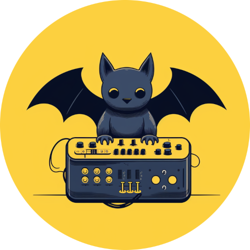

# Overview

Bats is a DAW that is a work in progress.



## Goals

### Lightweight

Bats should be lightweight enough to run on a Raspberry Pi.

# Build

## Dependencies

Bats depends on Guile Scheme, LV2, and Jack. To see a more detailed
set of dependencies, see the "Install Dependencies" section of
`./.github/workflows/test.yml`.

## Build Command

```shell
cargo build
guile -l main.scm
```

# API

The supported Bats interface is through Guile Scheme. More details
on Guile Scheme can be found in  the official [API
Reference](https://gnu.org/software/guile/manual/html_node/API-Reference.html)
page.

## `plugins`

Return the list of plugins.

```lisp
(list-head (plugins) 2)
(((classes "Reverb Plugin" "Delay Plugin" "Plugin")
  (id lv2
      "http://drobilla.net/plugins/mda/Ambience")
  (name . "MDA Ambience")
  (instrument? . #f))
 ((classes "Distortion Plugin" "Plugin")
  (id lv2
      "http://drobilla.net/plugins/mda/Bandisto")
  (name . "MDA Bandisto")
  (instrument? . #f)))
```

## `make-track`

Create a new track and return its id.

## `instantiate-plugin` (track-id plugin-id)

Instantiate plugin with `plugin-id` and add it to `track-id`. Returns
`#t` if successful or `#f` if not.

## `delete-track` (track-id)

Delete the track with the given id `track-id`. Returns `#t` if
successful or `#f` if not.

## `tracks`

Returns all the tracks.

```lisp
scheme@(guile-user)> (tracks)
(((plugin-count . 1)
  (volume . 0.5)
  (enabled? . #t)
  (track-idx . 0))
 ((plugin-count . 1)
  (volume . 0.3)
  (enabled? . #f)
  (track-idx . 1)))
```

## `settings`

Get the settings for the current session.

```lisp
scheme@(guile-user)> (settings)
((cpu-load . 4.25088757276535034) (sample-rate . 48000) (buffer-size . 1024))
```
